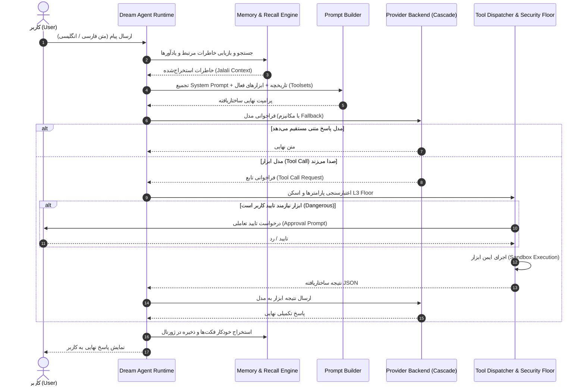

# سند جامع معماری دریم (Dream v2.0 Architecture Blueprint)

این سند مرجع رسمی و فنی معماری بازطراحی‌شده‌ی **دستیار هوشمند دریم (Dream Assistant v2.0)** است. این معماری با الهام از پیشرفته‌ترین فریم‌ورک‌های عامل‌های هوشمند (به‌ویژه **Hermes Agent** اثر Nous Research) و ارتقای آن با نوآوری‌های اختصاصی بومی، امنیت لایه‌بندی‌شده و استقلال از اینترنت طراحی شده است.

---

## ۱. نمای کلی سیستم و اصول بنیادین (Design Principles)

معماری نسخه ۲.۰ دریم بر ۵ اصل مهندسی استوار است:

1. **تفکیک کامل دامنه‌ها (Domain Decomposition & Modular Monolith):**
   - جایگزینی فایل‌های یکپارچه و سنگین با پکیج‌های ماژولار و تک‌مسئولیتی (Single-Responsibility Principle).
   - استفاده از الگوی **Facade + Sibling Modules** جهت تضمین ۱۰۰٪ سازگاری با کدهای پیشین (Zero Breaking Changes).

2. **معماری ارائه‌دهندگان چندگانه و تاب‌آوری خودکار (Multi-Provider & Fallback Cascade):**
   - انتزاع لایه اتصال به مدل‌ها (`BaseBackend`) با پشتیبانی همزمان از OpenAI، Anthropic Claude، Google Gemini، Ollama و AvalAI.
   - آبشار خطاناپذیر (Fallback Cascade) برای جابه‌جایی خودکار بین مدل‌ها در صورت بروز اختلال شبکه، پایان سهمیه یا خطای ۵xx.

3. **مدیریت پویای ابزارها (Dynamic & Extensible Toolsets):**
   - دسته‌بندی ابزارها در قالب Toolsetهای مستقل (`core`, `workspace`, `web`, `skills`, `reminders`, `system`).
   - فیلترینگ پویا برای کاهش بار کانتکست (Context Window Optimization) و کنترل دقیق سطح دسترسی زیرعامل‌ها (Subagents).

4. **سیستم مهارت‌های خودآموز و پایدار (Self-Learning Persistent Skills):**
   - ایجاد، ویرایش، نسخه‌بندی و بازیابی مهارت‌های قابل خواندن توسط انسان در قالب فایل‌های متنی و باندل‌های Markdown (`SKILL.md`).

5. **امنیت چندلایه‌ای و فایروال محتوا (Multi-Layer Defense-in-Depth):**
   - اجرای همزمان ۵ لایه حفاظتی:
     - **L1 (Approval Gate):** تایید صریح انسان برای ابزارهای پرریسک (`dangerous`).
     - **L2 (Path Safety):** جلوگیری از Directory Traversal و محافظت از اسامی رزرو شده ویندوز.
     - **L3 (Security Floor):** مسدودسازی قطعی دستورات مخرب سیستمی بر پایه Blocklist غیرقابل دورزدن.
     - **L4 (SSRF Defense):** فیلتر IPهای لوپ‌بک، خصوصی و پورت‌های محرمانه در جستجو و وب‌گردی.
     - **L5 (Untrusted Content Quarantine):** ایزوله‌سازی ورودی‌های خارجی و اسکن ضد تزریق پرامپت (Prompt Injection).

---

## ۲. دیاگرام جریان حیات درخواست (Turn Lifecycle Diagram)



---

## ۳. ساختار ماژولار پکیج‌ها (Package Architecture)

```text
dream/
├── agent/                   # موتور اجرایی عامل (Agent Loop Runtime)
│   ├── __init__.py          # اکسپورت‌های سازگار Facade
│   ├── dream.py             # کلاس اصلی Dream و چرخه گفتگو
│   ├── approval.py          # سیاست‌های تایید امنیتی (ApprovalPolicy)
│   ├── prompts.py           # تولید پرامپت سیستم و پرامپت‌های استخراج
│   ├── tools_wire.py        # تبدیل فرمت Tool Call به Wire Protocol
│   ├── extraction.py        # استخراج خودکار حافظه و یادگیری فکت‌ها
│   ├── reminders.py         # تطبیق و پردازش یادآورهای جلالی
│   ├── env_config.py        # پردازش متغیرهای محیطی DREAM_*
│   ├── user_agent.py        # مدیریت و اعتبارسنجی هدر User-Agent
│   └── backends/            # آداپتورهای ارتباط با مدل‌ها
│       ├── base.py          # پروتکل BaseBackend
│       ├── openai.py        # کلاینت استاندارد OpenAI/vLLM/AvalAI
│       ├── anthropic.py     # کلاینت Claude Messages API
│       ├── gemini.py        # کلاینت Google Gemini API
│       ├── ollama.py        # کلاینت مدل‌های محلی Ollama
│       ├── echo.py          # بک‌اند شبیه‌ساز تست
│       ├── fallback.py      # مدیریت آبشار و جابه‌جایی خطاناپذیر
│       └── factory.py       # کارخانه ساخت بک‌اند بر اساس تنظیمات
│
├── tools/                   # زیرسیستم جامع و توسعه‌پذیر ابزارها
│   ├── __init__.py          # رجیستری مرکزی و سازگاری به عقب
│   ├── base.py              # ساختار Tool، دکوراتور @tool و اعتبارسنجی
│   ├── toolsets.py          # مدیریت و فیلترینگ دسته‌بندی ابزارها
│   ├── execution.py         # دیسپچر مرکزی execute با فیلتر L3 Floor
│   ├── schemas.py           # تولید اسکیماهای OpenAI, Claude, Gemini
│   ├── datetime_tools.py    # تاریخ شمسی جلالی و ساعت IANA
│   ├── math_tools.py        # محاسبه ریاضی ایمن بر پایه AST
│   ├── workspace_tools.py   # خواندن و نوشتن فایل در ورک‌اسپیس
│   ├── web_tools.py         # جستجوی وب و اسکرپینگ امن با سقف بایت
│   ├── skill_tools.py       # ابزارهای مدیریت مهارت‌ها
│   ├── reminder_tools.py    # ابزارهای ثبت و لغو یادآورها
│   └── system_tools.py      # ابزارهای شل و ارتباطات پرریسک
│
├── memory.py                # موتور ذخیره‌سازی، تطبیق معنایی و نرمال‌سازی فارسی
├── skills/                  # زیرسیستم مهارت‌های خودکار و یادگیری مداوم
├── security/                # ماژول‌های ۵ لایه امنیت و قرنطینه
└── providers/               # رجیستری ارائه‌دهندگان، Keychain و PKCE OAuth
```

---

## ۴. ماتریس مقایسه تخصصی: Dream v2.0 در برابر Hermes Agent

| مؤلفه / قابلیت | Hermes Agent (Nous Research) | Dream Assistant v2.0 | مزیت رقابتی Dream |
| :--- | :--- | :--- | :--- |
| **زبان و تقویم بومی** | فقط انگلیسی (پشتیبانی عمومی چندزبانه) | **پشتیبانی درجه‌یک از زبان فارسی و تقویم جلالی** | نرمال‌سازی عمیق کاراکترها، تبدیل تاریخ هجری شمسی، ریشه‌یابی و تطبیق معنایی فارسی |
| **پشتیبانی از ارائه‌دهندگان** | OpenAI, Anthropic, Fireworks, Local | **OpenAI, Anthropic, Gemini, Ollama, AvalAI, DeepSeek** | پشتیبانی بومی از پلتفرم‌های ایرانی و بین‌المللی همراه با Fallback خودکار |
| **معماری ابزارها (Toolsets)** | دسته‌بندی توکار ابزارها (`toolsets.py`) | **ماژولار کامل + فیلترینگ پویا + اعتبارسنجی عمیق AST** | اعتبارسنجی عمق، سایز بایت، تشخیص چرخه و محافظت از نام‌های رزرو ویندوز |
| **امنیت و سندباکس** | سطح پایه (تایید خط فرمان) | **۵ لایه امنیت (L1 تا L5) + Security Floor + SSRF Guard** | جلوگیری قطعی از دستورات مخرب حتی در صورت تایید اشتباه مدل یا کاربر |
| **حریم خصوصی و آفلاین** | نیاز به اینترنت برای اغلب تسک‌ها | **عملکرد ۱۰۰٪ مستقل و آفلاین با دیتابیس لوکال SQLite و Ollama** | اطلاعات شخصی و پایگاه دانش هرگز بدون اجازه از سیستم خارج نمی‌شوند |
| **سیستم مهارت‌ها (Skills)** | تعریف اسکریپت‌ها و پرامپت‌ها | **مهارت‌های متنی انسان‌خوان + SKILL.md Bundles + نسخه‌بندی** | کاربر می‌تواند بدون دانش برنامه‌نویسی مهارت‌ها را در قالب فایل متنی ویرایش کند |
| **استخراج خودکار خاطرات** | حافظه خلاصه‌سازی ساده | **استخراج دوگانه فکت‌ها و ترجیحات با دسته‌بندی KINDS** | یادگیری خودکار عادات کاربر در طول جلسات بدون نیاز به دستور صریح |

---

## ۵. نقشه راه آینده (Future Roadmap to Transcendence)

- [x] **فاز ۱:** تفکیک ماژولار موتور عامل، رجیستری جامع ارائه‌دهندگان و سیستم پویای Toolsets.
- [ ] **فاز ۲:** فشرده‌سازی هوشمند کانتکست (Context Compression) و خلاصه چرخش‌های طولانی (Compaction).
- [ ] **فاز ۳:** هماهنگ‌کننده چندعاملی (Multi-Subagents Coordinator) برای تفویض موازی تسک‌ها.
- [ ] **فاز ۴:** رابط کاربری مدرن دسکتاپ (Tauri v2 + React) با پشتیبانی کامل راست‌به‌چپ (RTL).
