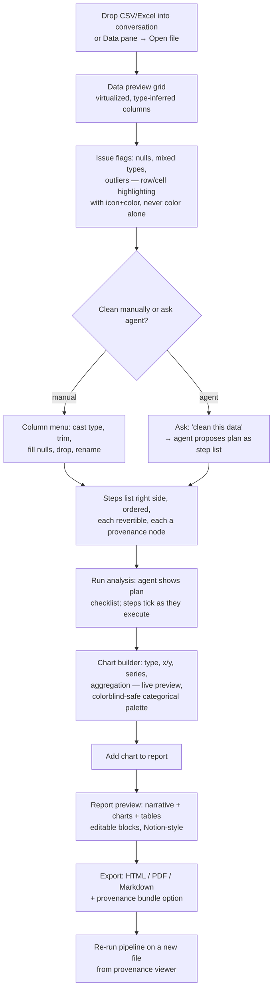

# Flow 3 — Data Science Flow (Gate G2)

`Load CSV → clean data → run analysis → generate chart → export report`

Owner: UXR · Reviewed & approved: DPM 2026-08-15

## Key interaction rules

1. **The grid is the anchor.** In a 3-pane data layout: transcript (left) · data grid (center) · steps/chart (right). Panes rearrangeable.
2. **Every transformation is a step.** Steps are named, ordered, individually revertible; reverting step *n* replays 1…n−1. Steps serialize into the provenance tree so Daniel (P2) can re-run on next month's file.
3. **Agent transparency.** When the agent cleans/analyzes, it emits the same step objects a manual user would — one mental model. "View code" on any step shows the executed snippet.
4. **Charts are artifacts.** Each chart links back to its producing step + data slice; hovering a chart in the report shows "from run #42, step 5".
5. **Large files.** >50 MB: preview loads first 10k rows with a banner "Previewing 10,000 of 1.2M rows — operations run on full file"; progress bar for full-file operations, cancellable.

## Error / empty / loading states

| State | Design |
| --- | --- |
| Unparseable file | Error panel with detected encoding/delimiter guesses, manual override controls |
| Empty grid (no file) | Drop-zone illustration + "Open file" + sample dataset link |
| Long-running analysis | Plan checklist with live step highlighting; skeleton in chart slot; cancel keeps completed steps |
| Chart with unsupported column combo | Inline explanation + suggested fix ("aggregate Y or pick a numeric column") |

## Acceptance (Gate G2 slice)

- Full path CSV→report possible with mouse only, keyboard only, and agent-driven.
- No transformation ever happens without a visible, revertible step entry.
- Export bundle reproduces the report from raw file + steps alone.
