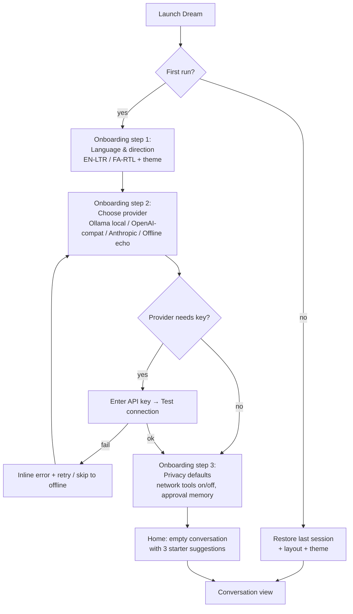

# Flow 1 — Primary Conversation Flow (Gate G2)

`Launch app → configure provider → start conversation → use tool → see result`

Owner: UXR · Reviewed & approved: DPM 2026-08-15

## 1.1 First launch (cold start)



**States:** every onboarding step has Back / Skip; skipping the provider lands in offline echo mode with a persistent, dismissible banner "Running offline — add a provider" linking to Settings → Providers.

## 1.2 A conversation turn with a tool call

```mermaid
sequenceDiagram
    actor U as User
    participant C as Composer
    participant T as Transcript
    participant A as Agent core
    participant D as Approval dialog

    U->>C: types message (Enter to send,\nShift+Enter newline, / opens commands)
    C->>T: user bubble appears instantly
    T->>T: assistant row: streaming indicator (≤300ms)
    A->>T: context chip "Used 3 memories · 1 reminder" (collapsible)
    A->>T: tool-call card: search_web(query) — status: running
    alt tool is dangerous
        A->>D: approval dialog (non-blocking sheet)
        D->>U: action, args, risk tier, plain-language consequence
        U->>D: Allow once / Always allow / Deny
        D->>A: decision (deny returns structured refusal to model)
    end
    A->>T: tool-call card → ok ✓ (expand = args + result JSON)
    A->>T: streamed answer tokens
    T->>U: complete turn; hover reveals copy / quote / provenance / retry
```

**Turn anatomy (top → bottom):** ① context chip (retrieved memories + reminders, collapsed by default, expandable to see each memory and its score) ② zero or more tool-call cards ③ assistant text (streaming) ④ turn footer (model name, duration, token count, provenance link).

**Interrupt:** while streaming, the send button becomes Stop. Stop preserves partial output, marks the turn "interrupted", and focuses the composer for redirection.

## 1.3 Error paths

| Failure | Surface | Recovery |
| --- | --- | --- |
| Provider unreachable | Turn-level error card (not a toast): "Couldn't reach Ollama at localhost:11434" | Retry · Switch provider · Open settings |
| Tool error | Tool-call card flips to `error` with message; model continues and may explain | Expand card for stderr/detail |
| Tool blocked (no approval) | Card shows `blocked` + reason; identical to CLI semantics | "Review approval settings" link |
| Rate limit | Error card with countdown | Auto-retry with backoff, cancellable |

## Acceptance (Gate G2 slice)

- New user reaches a working (offline) conversation in ≤ 3 screens with zero keys.
- Tool activity is never invisible; every call has a status the user can expand.
- Deny leaves the conversation coherent (model receives structured refusal).
