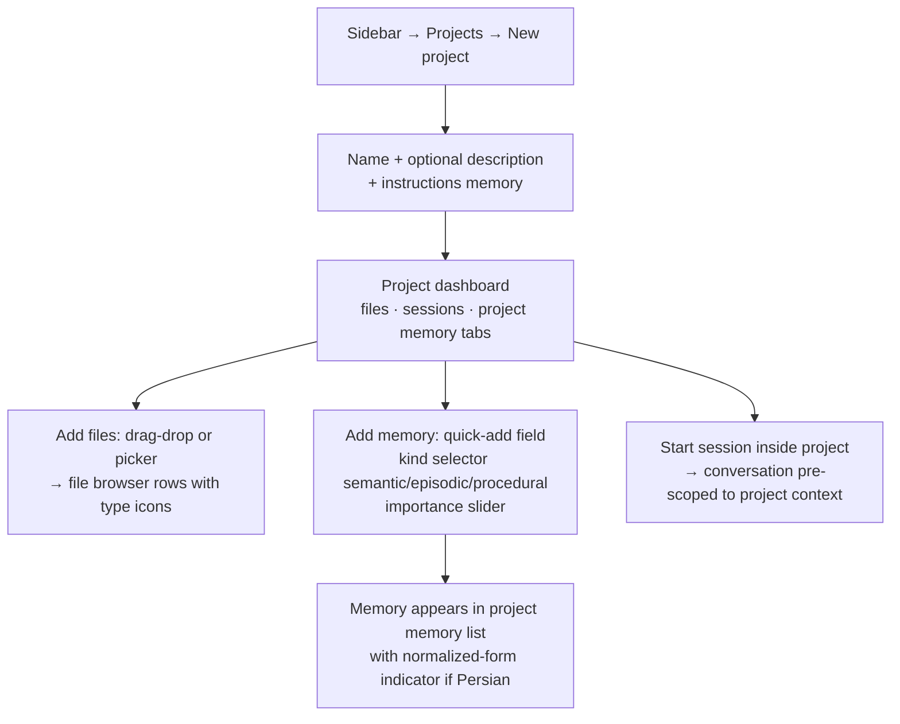
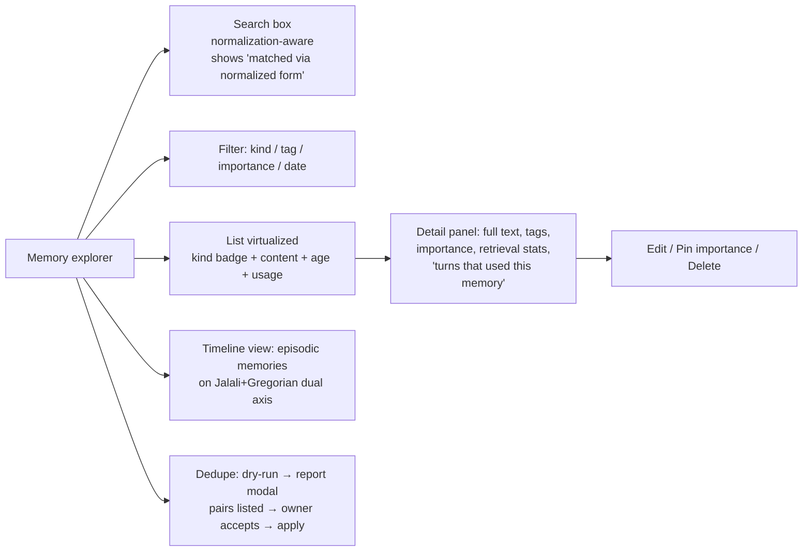
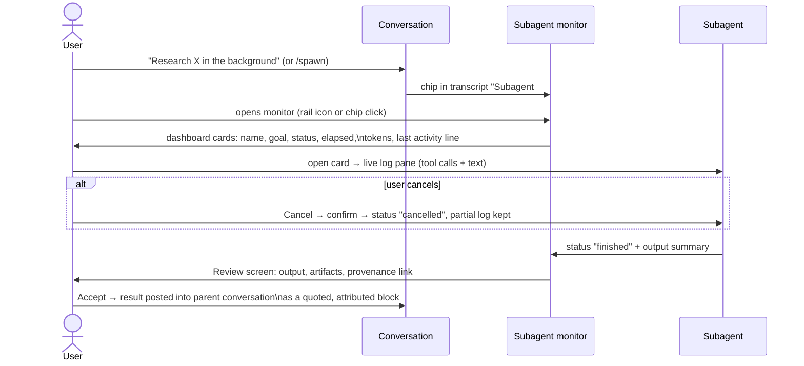

# Flow 2 — Project, Memory & Subagent Flow (Gate G2)

`Create project → add memory → spawn subagent → review output`

Owner: UXR · Reviewed & approved: DPM 2026-08-15

## 2.1 Create project and attach context

## 2.2 Memory explorer (global and per-project)

House rule (from `desktop.py` M26): **every destructive bulk action is dry-run first** — report → explicit acceptance → apply → list redraws from store.

## 2.3 Spawn and review a subagent

**States:** monitor empty state teaches the `/spawn` command; a failed subagent card shows the failing tool call directly; all logs persist to run history.

## Acceptance (Gate G2 slice)

- A memory added in a project is retrievable from a project session immediately and visibly attributed in the context chip.
- Subagent status is glanceable (rail badge) without opening the monitor.
- Accepting subagent output records provenance linking parent turn ↔ subagent run.
