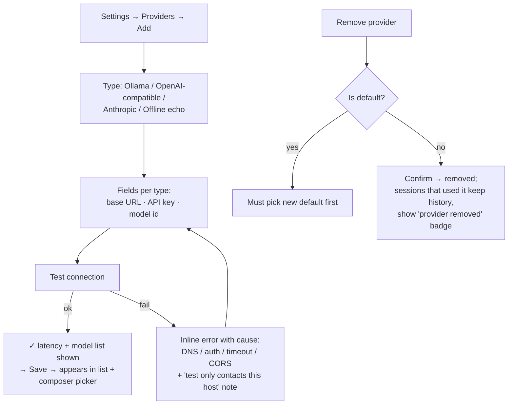
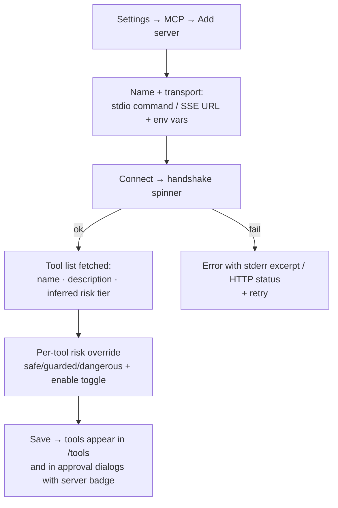
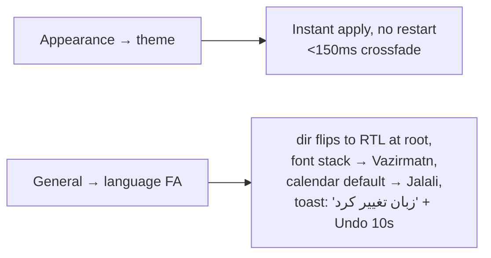
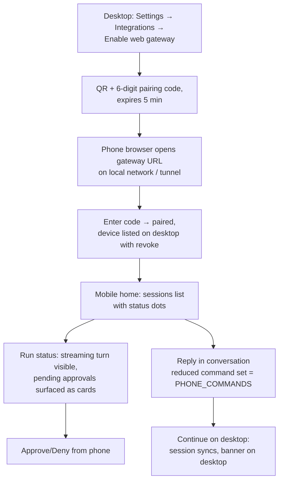

# Flow 4 — Settings & Configuration Flows (Gate G2)

`Add/remove provider → configure integrations → set up MCP server → change theme`

Owner: UXR · Reviewed & approved: DPM 2026-08-15

## 4.1 Settings information architecture

```text
Settings (modal on desktop ≥ md, full page on mobile)
├── General        language (EN/FA), calendar (Jalali/Gregorian primary),
│                  numerals (Persian/Latin), startup behavior
├── Appearance     theme (light/dark/system), accent, density
│                  (comfortable/compact), font size, reduce motion
├── Providers      provider list → add/edit/test/remove, default model,
│                  per-purpose models (chat/subagent/extraction)
├── Integrations   Telegram gateway (token, allowed chat, phone command set),
│                  web gateway (enable, pairing)
├── MCP Servers    server list → add (name, command/URL, env) → tool list
│                  with risk overrides → enable/disable
├── Permissions    standing approvals audit list (tool, scope, granted date,
│                  revoke), network tools master switch
├── Shortcuts      searchable keymap, rebind, conflict detection, presets
└── About          version, licenses, data location, export/backup
```

## 4.2 Add a provider (with test)



Privacy note (P1): the test button states exactly which host it will contact before it does; keys are stored in OS keychain via Tauri, shown masked with reveal-on-hold.

## 4.3 Add an MCP server



MCP tools are visually badged with their server of origin everywhere they appear (tool cards, approval dialogs, /tools list) so users always know code origin.

## 4.4 Change theme / language



Undo affordance on language change is mandatory — a user who switches to a language they can't read must be able to recover without navigating foreign menus.

## 4.5 Mobile / remote gateway flow (Task 2.5)



## 4.6 RTL flow verification (Task 2.6)

Every flow above re-walked in Persian: navigation rails flip to the right edge; breadcrumbs read right→left; chevrons mirror; progress bars fill right→left; the composer's send button sits at the inline-end (left edge in RTL); code blocks, URLs, latency numbers and API keys remain LTR islands (`dir="ltr"` + `unicode-bidi: isolate`). Verified checklist lives in `../accessibility-audit.md` §RTL.

## Acceptance (Gate G2 slice)

- Provider add→test→save ≤ 60 s for Ollama with defaults prefilled.
- No setting requires restart; all apply live with visible confirmation.
- Pairing is possible without typing a URL on the phone (QR).

---

**Gate G2: PASSED** — all six flows (primary, project/memory/subagent, data science, settings, mobile, RTL) mapped and DPM-approved. Proceed to wireframes.
