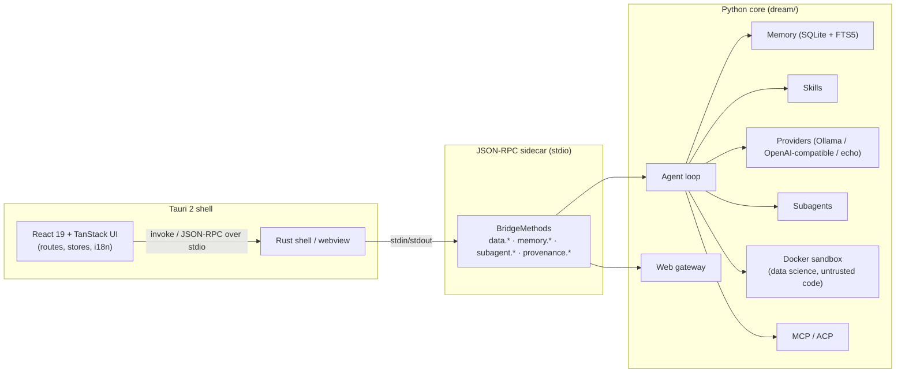

# Architecture

Dream is a Tauri 2 desktop shell over a Python "core" that is reached through a
JSON-RPC sidecar. The UI never imports Python and the core never knows about
React; the sidecar is the only bridge between them.

## Component diagram

## Layers

1. **Rust shell** (`apps/desktop/src-tauri/`) — window, tray, keychain access,
   the webview, and the spawn of the sidecar process.
2. **React UI** (`apps/desktop/src/`) — routes (`src/routes/`), Zustand stores
   (`src/stores/`), a typed bridge client (`src/lib/bridge/client.ts`), and the
   i18n layer (`src/lib/i18n/`).
3. **Sidecar** (`dream/bridge/`) — a JSON-RPC server over stdio; every method is
   a thin, typed wrapper over the core (`dream/bridge/methods.py`).
4. **Core** (`dream/`) — the agent loop, memory, tools (`dream/tools.py` with
   risk tiers), skills, providers, subagents, provenance, MCP/ACP, and the
   Docker sandbox integration.

## Data flow (one turn)

1. UI calls `client.call('chat.send', {…})` → JSON-RPC over stdio.
2. The sidecar dispatches to the agent loop.
3. The agent injects recalled memories, calls the provider, and may invoke
   tools (each risk-gated via `ApprovalPolicy`).
4. Tool results and memory writes stream back; the UI re-renders from the store.

## Key invariants

- `dream/` runtime dependencies stay empty (stdlib only; `keyring`/`Authlib`
  are the only declared deps). The scientific stack lives in the sandbox image.
- Every tool carries a risk tier (`safe`/`guarded`/`dangerous`).
- The React app is fully internationalised (`react-i18next`); only `fa` is RTL.
- Provenance is append-only with SHA-256 hash chaining.

See also `docs/bridge/protocol.md` (RPC reference) and
`docs/architecture/*.md` (per-feature deep dives).
